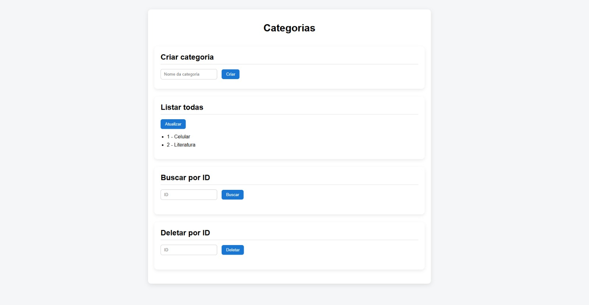
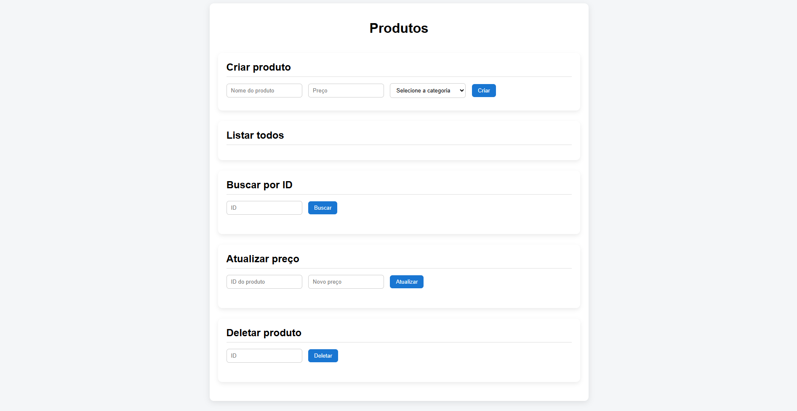

# 📦 Sistema de Produtos e Categorias

Este projeto consiste em uma **API REST (Backend)** desenvolvida em Python com FastAPI e um **Frontend web** em HTML, CSS e JavaScript puro para consumir essa API.

O sistema permite realizar um **CRUD completo** (Criar, Listar, Atualizar e Deletar) de **Produtos** e **Categorias**, respeitando o relacionamento:

* Uma **Categoria** pode ter vários **Produtos**
* Um **Produto** pertence a apenas uma **Categoria**

---

## 🧠 Visão geral do sistema

O backend é responsável por:

* Gerenciar categorias
* Gerenciar produtos
* Validar dados
* Persistir informações no banco SQLite
* **Executar testes automatizados (unitários e de integração)**

O frontend é responsável por:

* Interface visual para o usuário
* Consumo da API via `fetch`
* Exibição e manipulação dos dados

Os testes garantem:

* Confiabilidade das regras de negócio
* Correto funcionamento das rotas
* Segurança em alterações futuras no código

---

## 🖥️ Preview do Frontend

<p align="center">
  
</p>

> Interface simples, limpa e centralizada, permitindo acesso às telas de **Categorias** e **Produtos**.

<p align="center">
  
</p>

> Interface simples, limpa e centralizada, permitindo criar, listar todas, buscar por ID e deletar por ID.

<p align="center">
  
</p>

> Interface simples, limpa e centralizada, permitindo criar, listar todos, buscar por ID, atualizar preço e deletar por ID.

---

## 🚀 Tecnologias utilizadas

### Backend

* **Python 3.13**
* **FastAPI** – framework web
* **SQLAlchemy** – ORM
* **Pydantic** – validação de dados
* **SQLite** – banco de dados
* **Uvicorn** – servidor ASGI
* **Pytest** – testes automatizados
* **HTTPX / TestClient** – testes de rotas

### Frontend

* **HTML5**
* **CSS3**
* **JavaScript (Vanilla)**

---

## 📁 Estrutura do projeto

```
prova-estiario/
├── app/                 
│   ├── core/
│   ├── db/
│   ├── models/
│   ├── schemas/
│   ├── crud/
│   ├── router/
│   ├── main.py
│   └── app.db
│
├── tests/
│   ├── units/
│   │   └── crud/
│   │       ├── test_crud_categorias.py
│   │       └── test_crud_produtos.py
│   ├── integration/
│   │   └── router/
│   │       ├── test_router_categorias.py
│   │       └── test_router_produtos.py
│   ├── conftest.py
│   └── pytest.ini
│
└── front/               
    ├── index.html
    ├── categorias.html
    ├── produtos.html
    ├── css/
    │   ├── index.css
    │   ├── base.css
    │   ├── categorias.css
    │   └── produtos.css
    └── js/
        ├── api.js
        ├── categorias.js
        └── produtos.js
```

---

## ▶️ Como rodar o Backend

### 1️⃣ Criar e ativar o ambiente virtual

```bash
python -m venv .venv
```

Windows:

```bash
.venv\Scripts\activate
```

Linux / Mac:

```bash
source .venv/bin/activate
```

---

### 2️⃣ Instalar as dependências

```bash
pip install fastapi uvicorn sqlalchemy pydantic python-dotenv
```

### ➕ Dependências para testes

```bash
pip install pytest pytest-cov httpx
```

---

### 3️⃣ Rodar a aplicação

Na raiz do projeto:

```bash
uvicorn app.main:app --reload
```

A API estará disponível em:

```
http://127.0.0.1:8000
```

---

## 🧪 Testes automatizados

O projeto possui testes **unitários** e **de integração**, cobrindo:

* Operações de CRUD
* Regras de negócio
* Rotas da API
* Validações e erros esperados

### ▶️ Rodar os testes

Na raiz do projeto:

```bash
pytest
```

Os testes utilizam:

* Banco SQLite em memória
* Isolamento por teste
* Override de dependências do FastAPI

---

## 🌐 Como rodar o Frontend

O frontend é **estático**, não necessita de build nem servidor Node.

### Opção 1️⃣ – Abrir direto no navegador

* Abra o arquivo:

```
front/index.html
```

> ⚠️ Para evitar problemas de CORS, o backend deve estar rodando.

---

## 🔄 Resetar o banco de dados

O banco é um arquivo SQLite (`app.db`).

Para **zerar todos os dados**:

1. Pare o servidor
2. Apague o arquivo `app.db`
3. Suba a aplicação novamente

O banco será recriado automaticamente.

---

## 🔁 Pipeline CI/CD (GitHub Actions)

O projeto conta com uma **pipeline de Integração Contínua (CI)** utilizando **GitHub Actions**, garantindo qualidade, segurança e confiabilidade a cada alteração no código.

### 🎯 Objetivos da pipeline

A pipeline é executada automaticamente a cada:

* `push` para a branch `main`

Ela é responsável por:

* Instalar dependências
* Executar testes automatizados
* Gerar relatório de cobertura de testes
* Armazenar artefatos
* Enviar relatório por e-mail (opcional)

---

### 🧱 Jobs da pipeline

#### 1️⃣ **Checkout do código**

* Clona o repositório no ambiente do GitHub Actions

---

#### 2️⃣ **Configuração do ambiente Python**

* Utiliza a versão **Python 3.13**
* Cria ambiente isolado para execução

---

#### 3️⃣ **Instalação das dependências**

* Dependências da aplicação
* Dependências de testes (`pytest`, `pytest-cov`, `httpx`)

---

#### 4️⃣ **Execução dos testes**

* Executa todos os testes unitários e de integração
* Falha o workflow automaticamente se algum teste falhar

```bash
pytest --cov=app --cov-report=xml
```

---

#### 5️⃣ **Relatório de cobertura de testes**

* Gera arquivo `coverage.xml`
* Exibe métricas de cobertura de código

📊 Exemplo de métricas:

* Linhas cobertas: **96%+**
* Cobertura de regras de negócio e rotas

---

#### 6️⃣ **Upload de artefatos**

* Armazena o relatório de cobertura como artefato do workflow
* Pode ser baixado diretamente pela interface do GitHub

---

#### 7️⃣ **Envio de relatório por e-mail (opcional)**

* Envia o relatório de testes automaticamente por e-mail
* Utiliza SMTP seguro com **App Password**

Secrets necessários no repositório:

| Secret           | Descrição             |
| ---------------- | --------------------- |
| `EMAIL_USER`     | Email remetente       |
| `EMAIL_PASSWORD` | App Password do email |
| `EMAIL_TO`       | Email destinatário    |

---

### 📍 Onde visualizar os resultados

* **Aba Actions** do repositório
* Logs detalhados por job
* Relatórios baixáveis em **Artifacts**

---

## 👤 Autor

Projeto desenvolvido por Leandro Teixeira para a avaliação técnica de estágio, demonstrando a aplicação prática de conhecimentos em desenvolvimento backend e frontend.

---

## ✅ Status do projeto

✔ Backend funcional
✔ CRUD completo
✔ Relacionamento entre tabelas
✔ Frontend integrado
✔ Interface amigável e organizada
✔ Testes automatizados (unitários e integração)
✔ Pipeline CI/CD com GitHub Actions