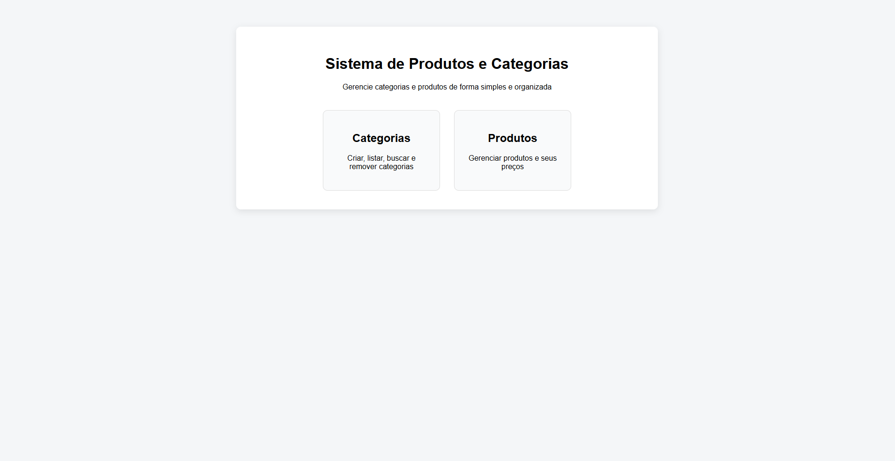

# 📦 Sistema de Produtos e Categorias

Este projeto consiste em uma **API REST (Backend)** desenvolvida em Python com FastAPI e um **Frontend web simples** em HTML, CSS e JavaScript puro para consumir essa API.

O sistema permite realizar um **CRUD completo** (Criar, Listar, Buscar, Atualizar e Deletar) de **Produtos** e **Categorias**, respeitando o relacionamento:

* Uma **Categoria** pode ter vários **Produtos**
* Um **Produto** pertence a apenas uma **Categoria**

---

## 🧠 Visão geral do sistema

O backend é responsável por:

* Gerenciar categorias
* Gerenciar produtos
* Validar dados
* Persistir informações no banco SQLite

O frontend é responsável por:

* Interface visual para o usuário
* Consumo da API via `fetch`
* Exibição e manipulação dos dados

---

## 🖥️ Preview do Frontend

<p align="center">
  
</p>

> Interface simples, limpa e centralizada, permitindo acesso às telas de **Categorias** e **Produtos**.

---

## 🚀 Tecnologias utilizadas

### Backend

* **Python 3.13**
* **FastAPI** – framework web
* **SQLAlchemy** – ORM
* **Pydantic** – validação de dados
* **SQLite** – banco de dados
* **Uvicorn** – servidor ASGI

### Frontend

* **HTML5**
* **CSS3**
* **JavaScript (Vanilla)**

---

## 📁 Estrutura do projeto

```
prova-estiario/
├── app/                 
│   ├── core/
│   ├── db/
│   ├── models/
│   ├── schemas/
│   ├── crud/
│   ├── router/
│   ├── main.py
│   └── app.db
│
└── front/               
    ├── index.html
    ├── categorias.html
    ├── produtos.html
    ├── css/
    │   ├── index.css
    │   ├── base.css
    │   ├── categorias.css
    │   └── produtos.css
    └── js/
        ├── api.js
        ├── categorias.js
        └── produtos.js
```

---

## ▶️ Como rodar o Backend

### 1️⃣ Criar e ativar o ambiente virtual

```bash
python -m venv .venv
```

Windows:

```bash
.venv\Scripts\activate
```

Linux / Mac:

```bash
source .venv/bin/activate
```

---

### 2️⃣ Instalar as dependências

```bash
pip install fastapi uvicorn sqlalchemy pydantic python-dotenv
```

---

### 3️⃣ Rodar a aplicação

Na raiz do projeto:

```bash
uvicorn app.main:app --reload
```

A API estará disponível em:

```
http://127.0.0.1:8000
```

---

## 🌐 Como rodar o Frontend

O frontend é **estático**, não necessita de build nem servidor Node.

### Opção 1️⃣ – Abrir direto no navegador

* Abra o arquivo:

```
front/index.html
```

> ⚠️ Para evitar problemas de CORS, o backend deve estar rodando.

---

## 🔄 Resetar o banco de dados

O banco é um arquivo SQLite (`app.db`).

Para **zerar todos os dados**:

1. Pare o servidor
2. Apague o arquivo `app.db`
3. Suba a aplicação novamente

O banco será recriado automaticamente.

---

## 👤 Autor

Projeto desenvolvido por **Leandro Teixeira** para fins de estudo, aprendizado em backend/frontend e avaliação técnica para estágio.

---

## ✅ Status do projeto

✔ Backend funcional
✔ CRUD completo
✔ Relacionamento entre tabelas
✔ Frontend integrado
✔ Interface amigável e organizada
